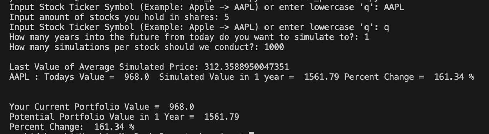
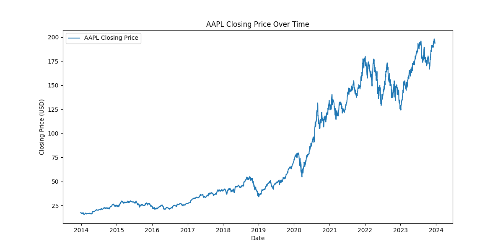
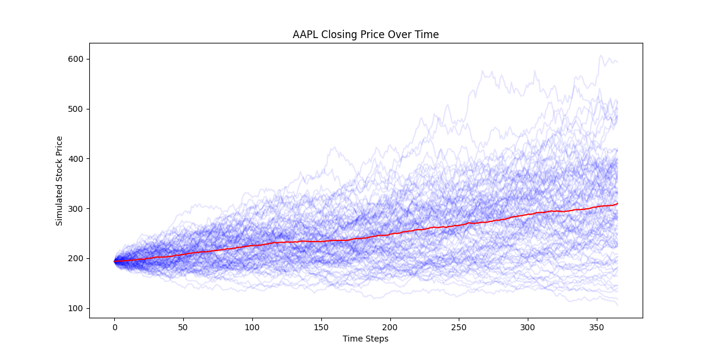

# Stock Price Simulator

## Project Description

Created a Python-based Stock Portfolio Monte Carlo Simulator that allows users to input their stock holdings and simulate potential future portfolio values using a Monte Carlo simulation. The simulator fetches historical stock data, calculates daily returns, and utilizes a geometric Brownian motion model for simulation. Users can specify the number of years into the future and the number of simulations per stock to estimate the range of possible portfolio values.

Through this project, I was able to learn some financial modeling, data visualization, and user input validation. The pandas and numpy libraries were used for data handling and matplot was used for visualization.

## How To

Start the program with `python3 stock_predictor.py`

The program will start and ask you for stock ticker symbols (ex. Apple Stocks -> AAPL) and the amount of shares you hold. You may enter as many as you like and you can enter 'q' when you are done. Then the program will ask how many years into the future you want to simulate the stock and how many simulations per stock it should do. Once you have entered this information, the program will execute and fetch the data of the stock and perform a simulation to return the results of the simulation. The program will also output a plot for each stock's past ten years closing prices and the simulation results.

Sample Execution and Output Below:

The Blue lines represent the simulated paths and the red represents the average of the simulations

## Limitations

The program does independent simulations over multiple stocks. In reality, certain stocks can have correlations between each other. This is not reflected in the simulations.

The program does not take into account dividend payments at this time.

## References

Geometric Brownian motion: https://en.wikipedia.org/wiki/Geometric_Brownian_motion

Options Pricing with Monte Carlo Simulation: https://www.tejwin.com/en/insight/options-pricing-with-monte-carlo-simulation/

Stock Prediction using Regression Algorithm in Python: https://medium.com/codex/stock-predication-using-regression-algorithm-in-python-fb8b426453b9
